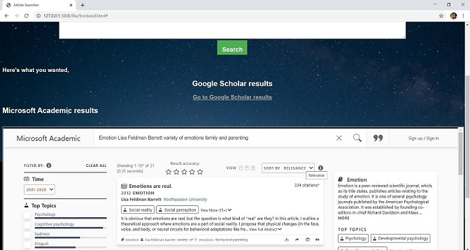

## Thesis Explorer

A web program which finds matching scientific theses supporting a web article. It uses [Watson NLU](https://cloud.ibm.com/apidocs/natural-language-understanding) to extract the keywords and uses Google Scholar and Microsoft Academic to search the matching Scientific Articles.



## Requirements 
Watson Cloud account with Watson NLU enabled. The feature's api key, url, and versions need to updated in the credentials.js file

## Installation
Requires NodeJS
```bash
npm install
```

## Execution
Thesis Explorer available at http://127.0.0.1:3000/file/frontend.html
